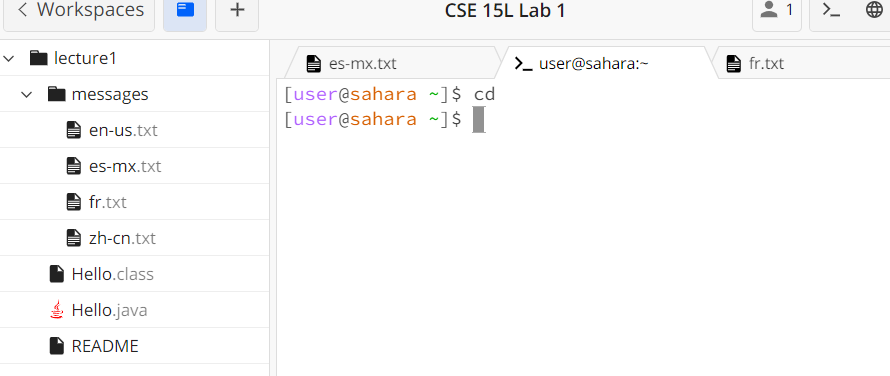
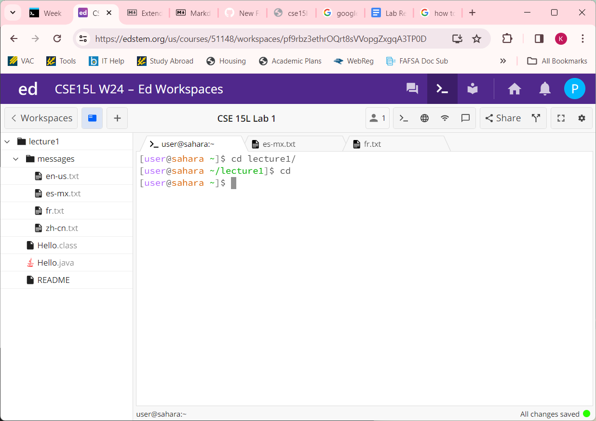
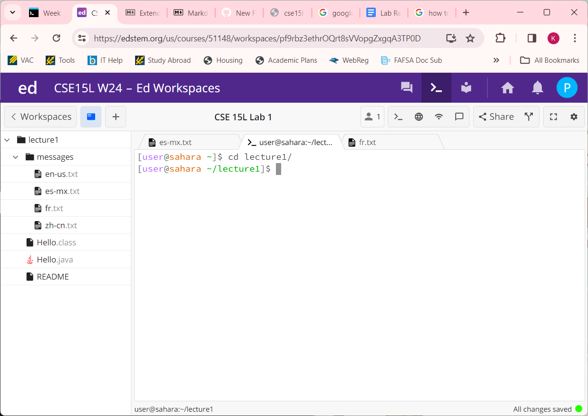

# Lab Report 1
**cd No Argument: with `Home` as the working directory**\
\
**cd No Argument: with `lecture1` as the working directory**\

- `cd` with no argument: since there is no specified directory, `cd` resets the directory to home. I tried this both with `cd` by itself and after inputting a different directory. After `cd` is typed without an argument, the next line shows `[user@sahara ~]` and the `~` represents the home directory. The output is not an error, instead the terminal automatically goes to the home directory without outputting anything.
  
**cd Directory Argument**
\
- `cd` with directory argument:  When I used a directory as the argument, the program changed the directory to `lecture1/`. `cd` successfully changes the directory to the directory I inputted, and this is shown on `[user@sahara ~/lecture1]`. 

- `cd` with file argument: when I inputted a message file as an argument, it caused an error in the terminal. Since the file is not a directory, `cd` cannot change the directory. This error is shown by a printed statement letting the user know that the argument was not a directory. 
