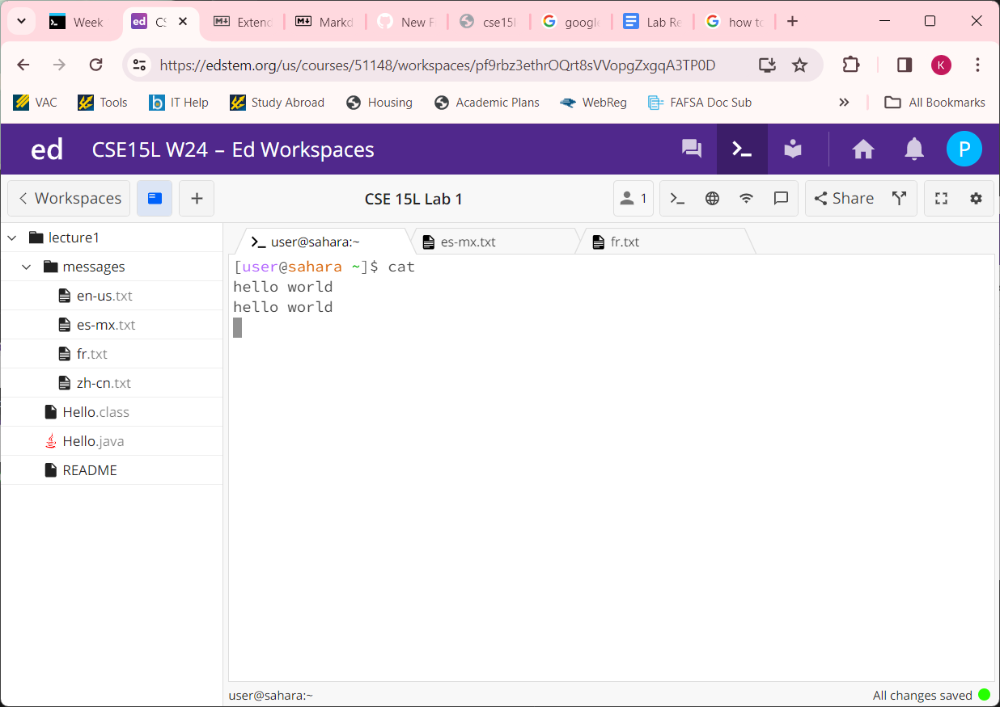
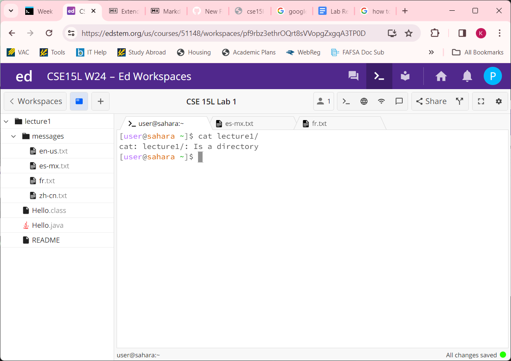
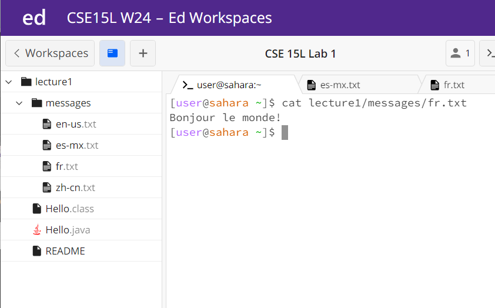

# Lab Report 1
**`cd` No Argument: with `Home` as the working directory**\
  
**`cd` No Argument: with `lecture1` as the working directory**\

- `cd` with no argument: since there is no specified directory, `cd` resets the directory to home. I tried this both with `cd` by itself and after inputting a different directory. After `cd` is typed without an argument, the next line shows `[user@sahara ~]` and the `~` represents the home directory. The output is not an error, instead the terminal automatically goes to the home directory without outputting anything.
  
**`cd` Directory Argument**
  
- `cd` with directory argument:  The working directory was `home`when the `cd` command was run. When I used the `lecture1/` directory as the argument, the program changed the directory to `lecture1/`. `cd` successfully changes the directory to the directory I inputted, and this is shown on `[user@sahara ~/lecture1]`.  

**`cd` File Argument**
  
- `cd` with file argument: The working directory was `lecture1` when I inputted the `messages/en-us.txt` message file as an argument. This caused an error in the terminal. Since a file is not a directory because it cannot hold any files within it, `cd` cannot change the directory to the message file. This error is shown by a printed statement letting the user know that the argument was not a directory, and `cd` will not work.

**`ls` No Argument**  
  

- `ls` with no argument - `ls` lists out the files and folders in the current directory. In this case, the working directory is `home` and there is only one folder in `home` titled `lecture1`, and this is outputted in the terminal.

**`ls` Directory Argument**  
  

- `ls` with a directory argument - The working directory is still the home directory. When I use the directory `lecture1` as an argument, `ls` lists out the files and folders in the `lecture1` directory. These include `Hello.class`, `Hello.java`, `message`, and `README`. The `Hello.class` file came from compiling `Hello.java` earlier in the lab.

**`ls` File Argument**  
 

- `ls` with a file argument - The working directory is the home directory. To pass a file in the `ls` command as an input, I used the path `lecture1/messages/zh-cn.txt`. The terminal cannot access any files or folders within a file, so instead it outputs the file name. This is not an error because the `ls` command just lists out the file details, such as the name.

**`cat` No Argument**  
  

- `cat` no argument - The working directory is the home directory. Takes you to a new line, where whatever you type in is printed. `cat` doesn’t need an argument. In the case where you don’t give an argument, the program concatenates the word you type and prints it as an output. Without an argument, it understands the user input as a String, and not a file. In the image above, I typed in `hello world` and the terminal printed my message back as an output.

**`cat` Directory Argument**  
  

- `cat` with directory as an argument - The working directory is the home directory. The program sends an error message saying that `lecture1/: is a directory and not a file`. Since the argument is not a file, `cat` cannot print out the file contents. This is an error, because `cat` has nothing to concatenate, since it needs file information but instead gets a folder as the argument.  

**`cat` File Argument**  
  

- `cat` with file as an argument - The working directory is the home directory. The program looks at the contents of the file that contains “Bonjour le monde!” and prints those contents out. 

