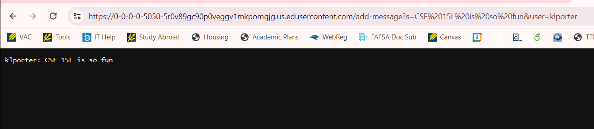
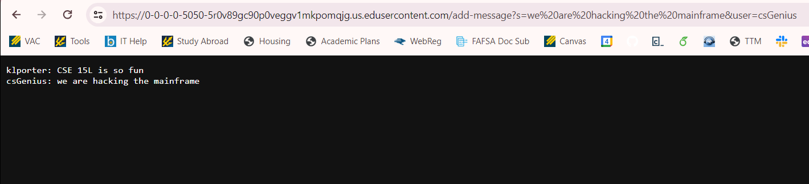
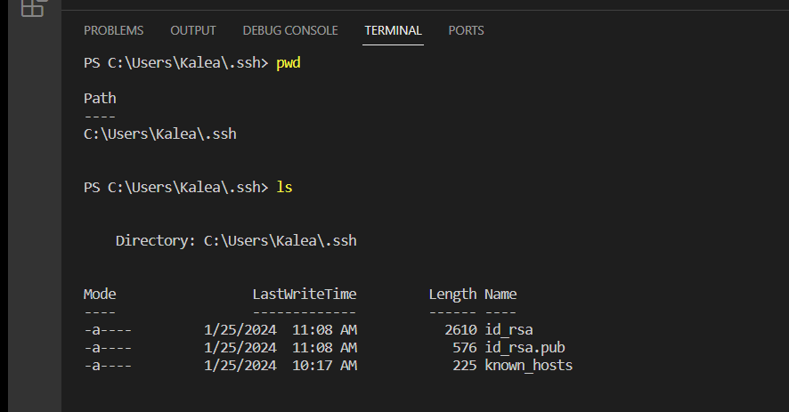
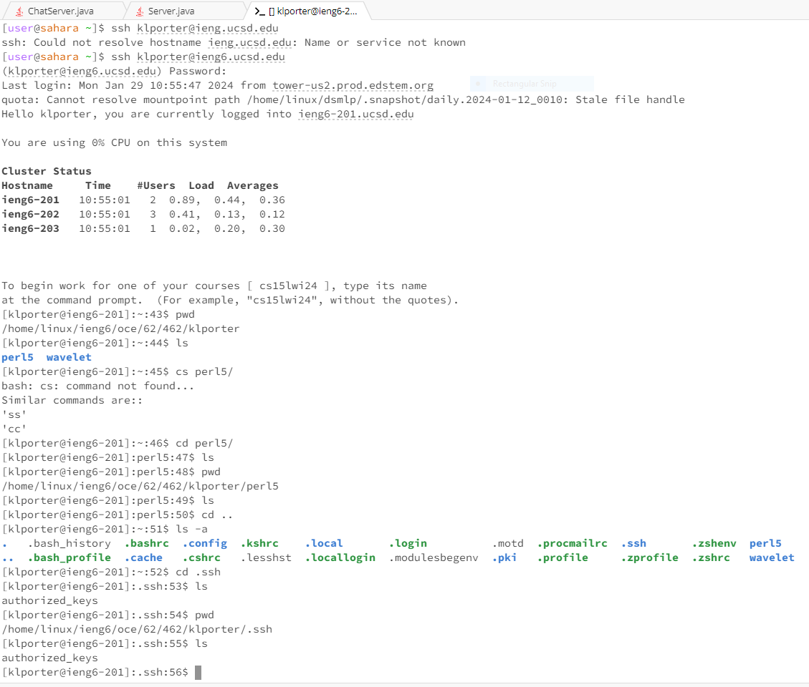
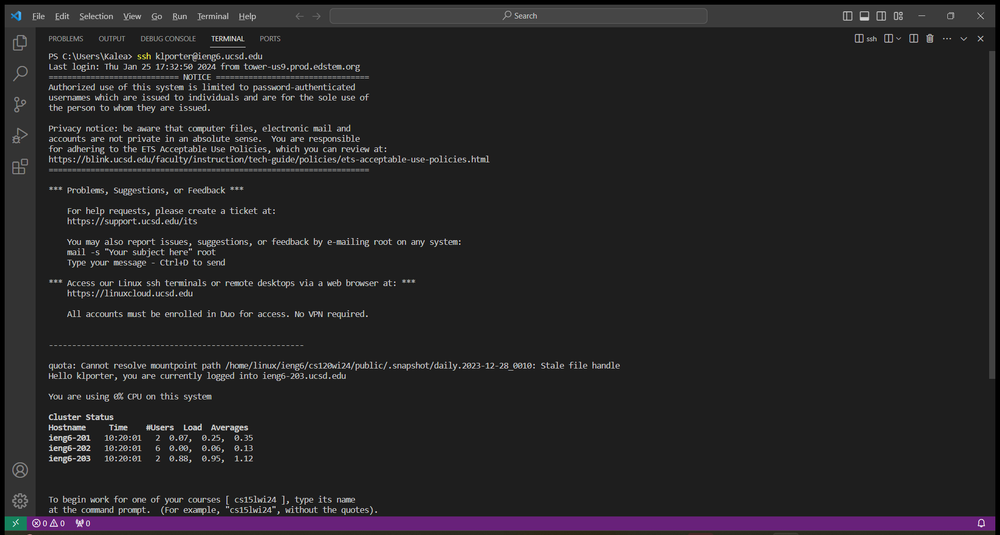

# Lab Report 2  

## Part 1  
**ChatServer.java code:** (also uses Server.java with the URLHandler interface given to us in class)
```
import java.io.IOException;
import java.net.URI;
import java.util.List;

class Handler implements URLHandler {
    String messages = "";
    public String handleRequest(URI url){
        String query = url.getQuery();
        if (url.getPath().equals("/add-message")) {
            if(query.startsWith("s=")) {
                String[] splitInput = url.getQuery().split("="); //["s", "<message>&user", "<user>"]
                String[] messageStrSplit = splitInput[1].split("&"); //["<message>", "user"]
                String messageRough = messageStrSplit[0]; //gets message
                String messageFinal = messageRough.replace("+", " "); //replace all + w/ space
                String userStr = splitInput[2]; //gets user from last elem in Input
                String messageToAdd = String.format("%s: %s \n", userStr, messageFinal);
                messages = messages + messageToAdd;
                return messages;
            }
            else {
                return "/add-message requires a query parameter s\n";
            }
        }
        else {
        return String.format("add a message using: /add-message?s=<string>&user=<string>");
        }
    }
}
class ChatServer {
    public static void main(String[] args) throws IOException {
        if(args.length == 0){
            System.out.println("Missing port number! Try any number between 1024 to 49151");
            return; 
        }
        int port = Integer.parseInt(args[0]);
        Server.start(port, new Handler());
    }
}
```
---

**First Add Message**  
  
The method `handleRequest` is called in my code. The argument to the `handleRequest` method is `/add-message?s=CSE 15L is so fun&user=klporter` *(Note: I inputted spaces, but the URL automatically replaced them with %20)*. I use the field `messages` (which is of type String) to store all of the past messages that are added. When the first message is passed in as an argument, `messages` is an empty string. I use local variables such as `messageFinal` and `userStr` to access substrings of the initial string that I split. Once I get the message and the user, I format these as the `user: message` format and add a new line command at the end. Once I finish splitting and getting the correct format for my chat message, I concatenate the chat message to `messages`. Since `messages` is an empty string, it now becomes `klporter: CSE 15L is so fun`. 

--- 
   
  
**Second Add Message**
  
The method `handleRequest` is called in my code. The argument to the `handleRequest` method is `/add-message?s=we are hacking the mainframe&user=csGenius` *(Note: I inputted spaces, but the URL automatically replaced them with %20)*. I use local variables such as `messageFinal` and `userStr` to access substrings of the initial string that I split. Once I get the message and the user, I format these as the `user: message` format and add a new line command at the end. I use the field `messages` (which is of type String) to store all of the past messages that are added. In this case, I already have the first message `“klporter: CSE 15L is so fun”` stored in messages and when I add my new message, `handleRequest` returns the messages string with the past message and the new message `“csGenius: we are hacking the mainframe”` added to it. I used `String.format` and `/n` to create a new line for each message. Now, the message looks like this:  
```
klporter: CSE 15L is so fun
csGenius: we are hacking the mainframe
```


## Part 2  
**1. The absolute path to the private key for the SSH key for logging into ieng6 (on your computer, an EdStem workspace, or on the home directory of the lab computer)**
  
I used VSCode to access the private key on my computer. The absolute path to the private key is `\Users\Kalea\.ssh\id_rsa` to access the private key. The other key in the `.ssh` directory is a public key, but the one we want to access is called `id_rsa`.  

---
  
**2. The absolute path to the public key for your SSH key for logging into ieng6 (this is the one you copied to your account on ieng6, so it should be a path on ieng6's file system)**
  
I used Edstem on a lab computer to access the public key. The absolute path to the public key is `/home/linux/ieng6/oce/62/462/klporter/.ssh/authorized_keys`. The public key is within the file `authorized_keys`, and I used the command `ls -a` to view the directories and files starting with a period.  

---
  
**3. A terminal interaction where you log into your ieng6 account without being asked for a password.**
  
As you can see from the image, I typed `ssh klporter@ieng6.ucsd.edu` in the terminal and was able to log in without having to type in a password.  


  

## Part 3  
Before working through Lab 2, I had no idea that I could connect to a remote server. It was really cool (and also crazy to initially wrap my head around) that I could connect to another computer that wasn't mine in the CSE basement using `ssh`, and that my commands would run on the remote computer. Everything about servers was completely new to me, but I thought it was so interesting how we can create and join servers. I also thought it was interesting that the `man` command provides information on other commands or files.  

