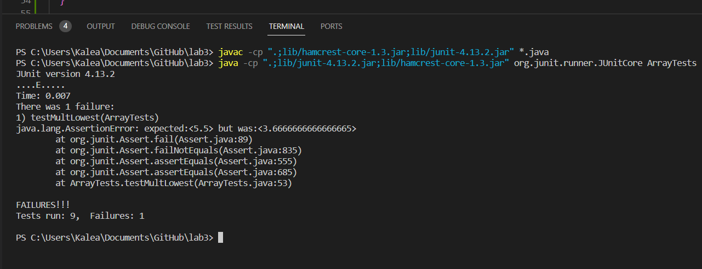

# Lab Report 3 - Bugs and Commands (Week 5)

## Part 1 - Bugs
Choose one of the bugs from week 4's lab.

Provide:

**Code for the `averageWithoutLowest` method from the `ArrayExamples` class with bugs**
```
  // Averages the numbers in the array (takes the mean), but leaves out the
  // lowest number when calculating. Returns 0 if there are no elements or just
  // 1 element in the array
  static double averageWithoutLowest(double[] arr) {
    if(arr.length < 2) { return 0.0; }
    double lowest = arr[0];
    for(double num: arr) {
      if(num < lowest) { lowest = num; }
    }
    double sum = 0;
    for(double num: arr) {
      if(num != lowest) { sum += num; }
    }
    return sum / (arr.length - 1);
  }
```
Above is the code for a method called `averageWithoutLowest` which is meant to find the average of all the numbers in the array except for the lowest value. It takes in a `double[]` array and returns a double representing the average. 

A failure-inducing input for the buggy program, as a JUnit test: 
```
@Test
public void testMultLowest() {
  double[] arrMultLowest = {2.0, 5.0, 6.0, 2.0};
  assertEquals(5.5, averageWithoutLowest(arrMultLowest);
}
```
This test aims to test `averageWithoutLowest` so the lowest number in the array has multiple occurrences. For example, the array I used was {2.0, 5.0, 6.0, 2.0} with 2.0 being the lowest number which occurs twice in the array. If we take the average without lowest, we would only consider 5.0 and 6.0, so the sum would be 11.0, and 11.0/2 should yield 5.5. However, if we run the code, we get 11.0 as the sum, but instead we divide the sum by `arr.length - 1` which is 3 in this case since there are 4 elements in the array. This would give us a result of around 3.6666, which is not equal to the expected output of 5.5. 

An input that doesn't induce a failure, as a JUnit test and any associated code (write it as a code block in Markdown):
```
@Test
public void testLowestSum() {
  double[] arrLowest = {1.0, 7.0, 9.0};
  assertEquals(8.0, averageWithoutLowest(arrLowest);
}
```
This test aims to test `averageWithoutLowest` so the lowest number in the array has one occurrence. For example, the array I used was {1.0, 7.0, 9.0} with 1.0 being the lowest number which occurs once in the array. If we take the average without lowest, we would only consider 7.0 and 9.0, so the sum would be 16.0, and 16.0/2 should yield 8.0. The code takes the sum of 16.0 and uses `arr.length - 1` which is 3 - 1 = 2. 16.0 / 2 is 8.0, and this matches the expected output. 

The symptom, as the output of running the tests (provide it as a screenshot of running JUnit with at least the two inputs above)
  
Both tests were added to the test file, and one of them failed. The second test, meant to test having one lowest element, passed and matched the expected outcome. However, the first test I wrote that tested multiple lowest elements failed because the program expected 5.5 but instead got 3.666666. 

The bug, as the before-and-after code change required to fix it (as two code blocks in Markdown):
Before the code change:
```
double sum = 0;
  for(double num: arr) {
    if(num != lowest) { sum += num; }
  }
  return sum / (arr.length - 1);
```
Before the code change, the method correctly finds the lowest number and collects the sum. However, when calculating its average, it divides by `arr.length - 1` in every case. This fails to take into account multiple low number occurrences. 

The fixed code after the code change:
```
double sum = 0;
int numElems = 0;
  for(double num: arr) {
    if(num != lowest) { 
      numElems += 1;
      sum += num;
    }
  }
  return sum / numElems;
```
Instead of using the length to divide the sum by, the corrected code adds a local variable called `numElems` which increments every time a number in the array is *not* equal to the lowest number. At the end, we divide sum by only the number of elements that are not the lowest value, which fixes the bug.  

Therefore, the bug was using `arr.length - 1` to calculate the number of elements to divide the sum by. In the edge case where there can be multiple lowest numbers equal to each other, the code does not add these values to the sum, but the code still counts some of these lowest numbers in the divisor because it assumes that we should just subtract 1 from the number of elements each time. Since this is a sum without lowest, we only want to divide by values we know are not the lowest.  


## Part 2 - Researching Commands
The command I decided to research is `grep`. The examples I provided are listed down below. 

1.
       -x, --line-regexp
              "Select only those matches that exactly match the whole
              line.  For a regular expression pattern, this is like
              parenthesizing the pattern and then surrounding it with ^
              and $."
   Source link: [Link](https://man7.org/linux/man-pages/man1/grep.1.html)

  
**Example 1**  
```
[user@sahara ~/docsearch/technical/911report]$ grep -x "            FROM THREAT TO THREAT" chapter-6.txt
            FROM THREAT TO THREAT
```

In this example, I used `grep -x "            FROM THREAT TO THREAT" chapter-6.txt` in the `911report` directory, searching for all lines that are exactly the same as the line: `"            FROM THREAT TO THREAT"` in the file `chapter-6.txt`. The output of the line is printed out to us when it matches the parameter.   the letter e in them for all files and directories in `docsearch`. This is useful when you want to check for a complete match, not just a match anywhere within the line. For example, if I wanted to verify data in a file matched exactly what I inputted in the parameters, it would be best to use `-x`. 
Source: ChatGPT
My prompt: why is using grep -x useful?
The output: 
```
Using the -x option with grep is useful when you want to match entire lines exactly. This can be beneficial in several scenarios:
Exact Match Requirement: Sometimes you need to find lines that match a specific phrase precisely. For example, if you're searching for configuration settings in a file, you may want to ensure that you're getting the exact line that defines a particular setting.
Avoiding Partial Matches: Without the -x option, grep would return lines containing the search phrase anywhere within them. However, if you're interested only in complete matches and not partial matches, -x ensures you only get results where the entire line matches your search phrase.
Data Validation: When validating data or input files, ensuring that entries match exactly what you expect can be crucial. Using -x helps in verifying that entries are precise matches, reducing the chances of false positives or missing relevant data.
Scripting and Automation: In scripting or automation tasks, precise matching can help ensure the correctness of operations. By using -x, you can write scripts that rely on exact matches, which can be important for reliable and predictable behavior.
In summary, the -x option is useful when you need to ensure exact matching of phrases within lines, which can be critical for certain search, validation, and scripting tasks.
```
I used the "Data Validation" example that ChatGPT discusses in its answer. 


**Example 2**  
```
[user@sahara ~/docsearch/technical/biomed]$ grep -x -c "        Background" *
1468-6708-3-10.txt:0
1468-6708-3-1.txt:0
1468-6708-3-3.txt:0
1468-6708-3-4.txt:0
1468-6708-3-7.txt:1
1471-2091-2-10.txt:1
1471-2091-2-11.txt:0
1471-2091-2-12.txt:1
1471-2091-2-13.txt:1
1471-2091-2-16.txt:1
1471-2091-2-5.txt:1
1471-2091-2-7.txt:1
1471-2091-2-9.txt:1
1471-2091-3-13.txt:1
1471-2091-3-14.txt:1
1471-2091-3-15.txt:1
1471-2091-3-16.txt:1
... lines removed ...
bcr635.txt:0
```

In this next example, I used `grep -x -c "        Background" *` in the `biomed` directory. This time I used the `-x` command with `-c`, which counts the number of lines in each file that contain the exact line I inputted. As you can see in the terminal, each file is displayed in the format `file.txt: <countNumber>` where we see some files have the complete line `"        Background"` once in the file or not at all in the file. Using `c` with `-x` is really useful when we don't want to see the line printed directly, but we want to get a count for how many lines in a file match what we inputted. This could be useful in a project where you are analyzing speech patterns and you are counting up certain specific patterns of speech, for example. 
Source link: [Link](https://man7.org/linux/man-pages/man1/grep.1.html)
Source link: [Link](https://docs.oracle.com/cd/E19253-01/806-7612/filesearch-99633/index.html) 


2.
       -v, --invert-match
              "Invert the sense of matching, to select non-matching
              lines."
   Source link: [Link](https://man7.org/linux/man-pages/man1/grep.1.html)
   
**Example 1**  
```
[user@sahara ~/docsearch]$ grep -v e *
DocSearchServer.java:import java.util.ArrayList;
DocSearchServer.java:import java.util.List;
DocSearchServer.java:
DocSearchServer.java:            }
DocSearchServer.java:        }
DocSearchServer.java:        }
DocSearchServer.java:    }
DocSearchServer.java:    }
DocSearchServer.java:}
DocSearchServer.java:
DocSearchServer.java:    }
DocSearchServer.java:                       foundPaths.add(f.toString());
...lines removed...
TestDocSearch.java:}
TestDocSearch.java:}
TestDocSearch.java:
```
In this example, I used `grep -v e *` on the `docsearch` directory, searching for all lines that do *not* contain the letter e in them for all files and directories in `docsearch`. This is useful when looking for lines that do not contain a certain element or pattern, in this case, looking for any line without the letter e.

**Example 2**  
```
[user@sahara ~/docsearch/technical/911report]$ grep -v a chapter-1.txt


"WE HAVE SOME PLANES"


INSIDE THE FOUR FLIGHTS

...lines removed...

NATIONAL CRISIS MANAGEMENT


The Agencies Confer
...more blank lines below...
```
In this next example, I used `grep -v a chapter-1.txt` in the `911report` directory. This time I did this operation only on the `chapter-1.txt` file. As you can see, `grep -v` prints out all the lines in `chapter-1.txt` that do not have "a" in them. Just to note, the line that has the word "PLANES" does technically have the letter "A" in it, but `grep -v` is case sensitive so does not count "A" as equal to "a". I used vowels because they are very common and would eliminate a lot of text from being returned, but in cases where you would want to perform an operation on lines that did not contain a certain element, this command would be especially useful. 

Source link: [Link](https://docs.oracle.com/cd/E19253-01/806-7612/filesearch-99633/index.html)  

3. 
       -i, --ignore-case
              Ignore case distinctions in patterns and input data, so
              that characters that differ only in case match each other.
**Example 1**  
```
[user@sahara ~/docsearch/technical/biomed]$ grep -i "cell" 1468-6708-3-7.txt
          interstitial fluid volume, and extracellular fluid volume
          Neurohormonal and Cellular Effects
          Other mechanisms for cellular injury have been
          antagonists alter cellular repair mechanisms, possibly
```

In this example, I used `grep -i "cell" 1468-6708-3-7.txt` in the `biomed` directory on the file `1468-6708-3-7.txt`. I was searching for the word "cell", using the `-i` command to ignore any case sensitivity. As seen in the output, lines containing the word "cell" show up with both a lowercase and a capital c. This can be useful when you are trying to search for a keyword but are unsure about if it is uppercase, lowercase, or both. This will make sure that you will get all the instances of the keyword you are searching.  
Source link: [Link](https://man7.org/linux/man-pages/man1/grep.1.html)

**Example 2**  
```
[user@sahara ~/docsearch/technical/911report]$ grep -i "security" *
chapter-10.txt:                President's remarks, while the lead Secret Service agent reviewed the security
chapter-10.txt:                for security reasons was taped and not broadcast live, and the traveling party
chapter-10.txt:                narrowly escaped direct attack. Extraordinary security precautions were put in place
chapter-10.txt:            Following his speech, President Bush met again with his National Security Council
chapter-10.txt:                    airspace reopened for use by airports that met newly improvised security
chapter-10.txt:                Deciding when and how to return border and port security to more normal
chapter-10.txt:                task, none had security as its primary mission. By September 14, Vice President
chapter-10.txt:                security adviser and Homeland Security Council-paralleling the National Security
chapter-10.txt:                Director Robert Mueller. From the White House staff, National Security Advisor
chapter-10.txt:            In this restricted National Security Council meeting, the President said it was a
chapter-10.txt:                imprisoned foreigners; and comply with all UN Security Council resolutions.
chapter-10.txt:                National Security Presidential Directive 9, now titled "Defeating the Terrorist
chapter-10.txt:                    of what the armed forces call "security and stability operations."
chapter-11.txt:                U.S. spending on national security was cut following the end of the Soviet military
chapter-11.txt:                Caucasus" (June 1999), "Bin Ladin to Exploit Looser Security During
chapter-11.txt:                these scenarios were slow to work their way into the thinking of aviation security
chapter-11.txt:                security in the United States. The Gore Commission's report, having thoroughly
chapter-11.txt:                airport and airline security procedures.
chapter-11.txt:                Security Group devoted largely to the possibility of a possible airplane hijacking
chapter-11.txt:                Aviation Security intelligence office summarized the Bin Ladin hijacking threat.
chapter-11.txt:            4. Neither the intelligence community nor aviation security experts analyzed systemic
chapter-11.txt:                the systemic issues of how to strengthen the layered security defenses to protect
... lines removed ...
preface.txt:                and national security did not understand how grave this threat could be, and did not
```
In this example, I used `grep -i "security" *` in the `911report` directory on all the files. I was searching for the word "security", using the `-i` command to ignore any case sensitivity. As seen in the output, lines containing the word "security" show up with the word regardness of lowercase and uppercase. This helped me get all words resembling "security" without worrying about uppercase and lowercase.  
Source link: [Link](https://man7.org/linux/man-pages/man1/grep.1.html)

4. 
       -e PATTERNS, --regexp=PATTERNS
              Use PATTERNS as the patterns.  If this option is used
              multiple times or is combined with the -f (--file) option,
              search for all patterns given.

**Example 1**  
```
[user@sahara ~/docsearch/technical/911report]$ grep -e "Arabic" -e "United States" chapter-2.txt
                physician, Ayman al Zawahiri, arranged from their Afghan headquarters for an Arabic
                accepted way to transliterate Arabic words and names into English. We have relied on
                a mix of common sense, the sound of the name in Arabic, and common usage in source
                since 1992 that singled out the United States for attack. In August 1996, Bin Ladin
                the United States "left the area carrying disappointment, humiliation, defeat and
                "the United States rushed out of Somalia in shame and disgrace." Citing the Soviet
            Plans to attack the United States were developed with unwavering singlemindedness
                and economic malaise. He also stresses grievances against the United States widely
                government to study in the United States in the late 1940s, Qutb returned with an
                the United States because of issues ranging from Iraq to Palestine to America's
            Bin Ladin's grievance with the United States may have started in reaction to specific
                of mankind." If the United States did not comply, it would be at war with the
                the world, including the United States. Some were set up by Islamic extremists or
                United States supplied billions of dollars worth of secret assistance to rebel
                they received little or no assistance from the United States.
                1980s, Abdel Rahman found refuge in the United States. From his headquarters in
            This pattern of expansion through building alliances extended to the United States. A
                participate in terrorist actions in the United States in the early 1990s and in al
            Bin Ladin began delivering diatribes against the United States before he left Saudi
                the United States. Not long afterward, senior al Qaeda operatives and trainers
                came to power in Khartoum, the United States and other Western governments had
                Sudanese-born Arab, had spent time in the United States and had been recruited for
                informant for the United States. Also testifying about al Qaeda in a U.S. court was
                enterprise for war against the United States.
                In March 1998, after Bin Ladin's public fatwa against the United States, two al
                indicate some common themes in both sides' hatred of the United States. But to date
                United States.
                former Egyptian army officer who had moved to the United States in the mid-1980s,
                United States to appear before a grand jury investigating Bin Ladin, the job of cell
                Afghanistan. A week later, it appeared in Al Quds al Arabi, the same Arabic-language
```
In this example, I used `grep -e "Arabic -e "United States chapter-2.txt` on the `911report` directory to search for all lines in the file `chapter-2.txt` that contain either `Arabic` or `United States`e in them. This is useful when looking for multiple patterns in a file or multiple files. This allows me to broaden my search to all lines that contain any of my inputs. For this, I put `-e` in front of each parameter I want to search for.  
Source link: [Link](https://docs.oracle.com/cd/E19253-01/806-7612/filesearch-99633/index.html)
**Example 2**  
```
grep -c -e "levels" -e "trials" *
1468-6708-3-10.txt:2
1468-6708-3-1.txt:12
1468-6708-3-3.txt:14
1468-6708-3-4.txt:11
1468-6708-3-7.txt:13
1471-2091-2-10.txt:3
1471-2091-2-11.txt:3
1471-2091-2-12.txt:0
1471-2091-2-13.txt:0
1471-2091-2-16.txt:0
1471-2091-2-5.txt:16
... lines removed ...
bcr635.txt:0
```
In this next example, I used `grep -c -e "levels" -e "trials" *` in the `biomed` directory. I did this operation on all the files in the `biomed` directory and used `-c` to count the number of occurrences. This is helpful to see the number of times multiple patters occurred in each file. This can be useful for figuring out the number of occurrences for pattern 1 AND pattern 2, which could be used in data analysis.  
Source: `man grep`  
Source link: [Link](https://man7.org/linux/man-pages/man1/grep.1.html)  

