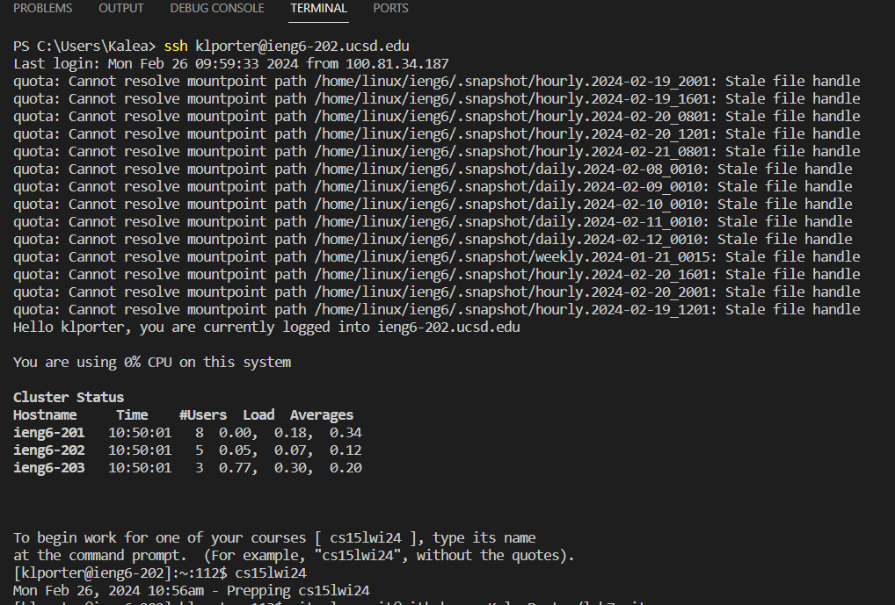
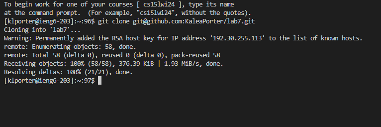
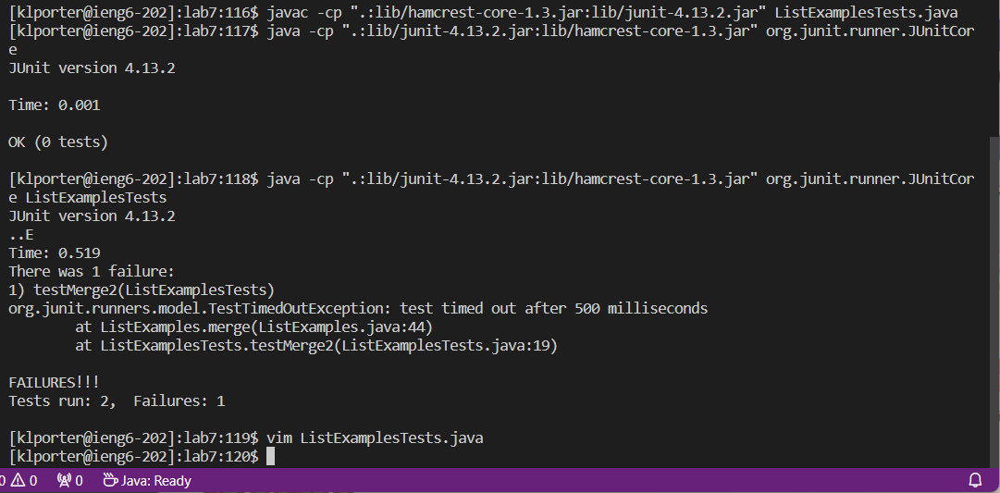
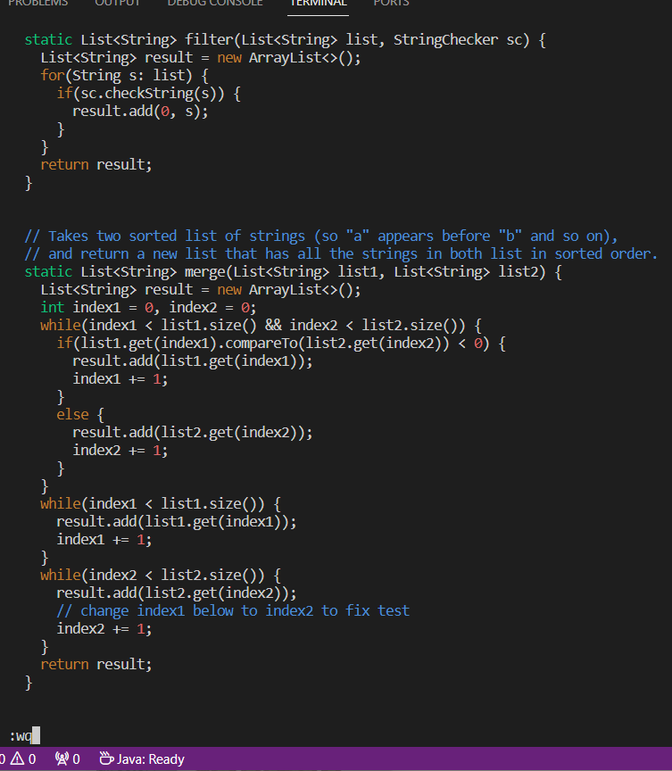
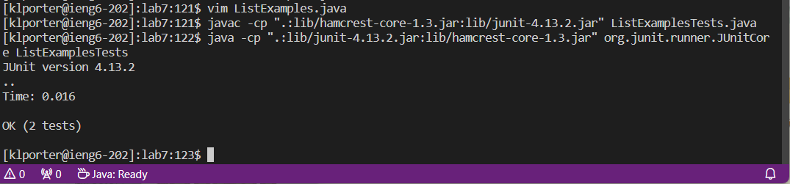
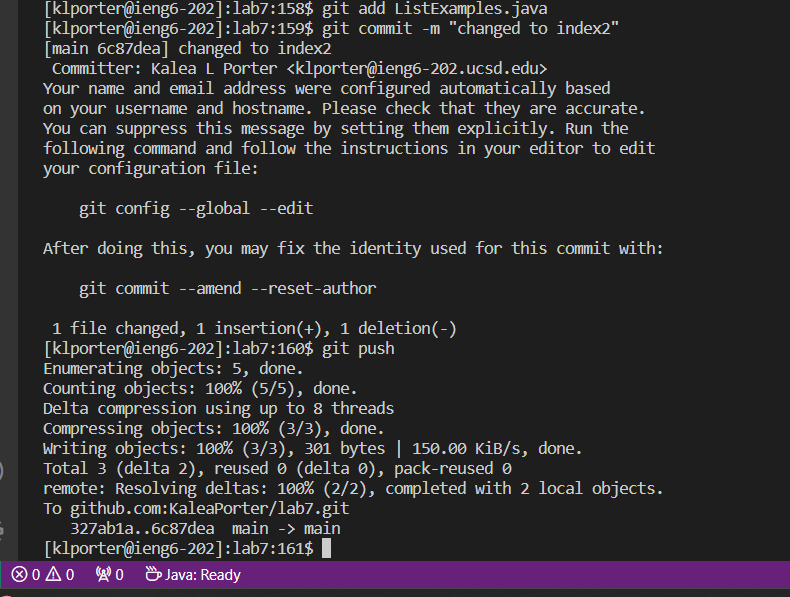
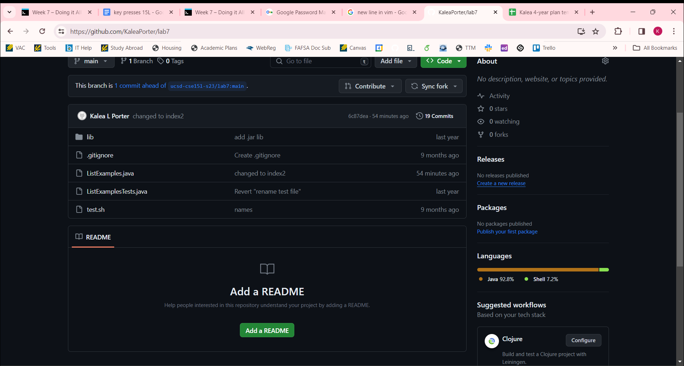

# Lab Report 4

## Step 4
**Log into ieng6**  
  
Keys pressed: `Ctrl-R` ssh `<enter>`
The ssh `klporter@ieng6-202.ucsd.edu` command was somewhere in my search history, but I wasn’t sure so I used `Ctrl-R` to search for `ssh` and hit enter. I got successfully logged into `ieng6` without needing a password.    
Keys pressed: cs15`<tab><enter>`  
I used the tab key to finish writing cs15lwi24 to log into class and hit enter.

## Step 5
**Clone your fork of the repository from your Github account (using the SSH URL)**  
  
Keys pressed: `<Ctrl-C>` to copy the SSH URL, then `<Ctrl-V><right-click>` to paste the URL. For VSCode, I have to right click for something to fully paste after Ctrl-V.   
This was used to be `git clone git@github.com:KaleaPorter/lab7.git` with the SSH URL to clone the lab 7 repository fork into `ieng6`.  

## Step 6  
**Run the tests, demonstrating that they fail**  
  
Keys pressed: cd l`<tab>` 
Change the current directory to `lab7/`.  
Keys pressed: `<up><up><up><up><backspace><backspace><backspace><backspace><backspace><backspace>` List`<tab>`T`<tab><enter>`  
Used the command `javac -cp ".;lib/hamcrest-core-1.3.jar;lib/junit-4.13.2.jar" .java` from earlier, but backspaced to change `.java` to `ListExamplesTests.java`, then hit `<enter>`.  
Keys pressed: `<up><up><up><up><up><up><up><enter>`  
The java command was 7 up in the search history, so I used the up arrow to access it then pressed enter.  

## Step 7  
**Edit the code file to fix the failing test**  
  
Keys pressed: `vim` L`<tab>`.java`<enter>`   
`j` 44 lines down   
`l` 11 times to go right  
`x` to delete 1  
`i` 2 to insert 2 in the place of the previous 1  
:wq<enter>  
I used `vim` to edit the `ListExamples.java` file. Once in the `vim` editor, I was able to navigate to `index1` and change it to `index2`. I moved down and right because my cursor started at the top right once I entered vim. After deleting 1 and inserting 2, I went back to normal mode to save and exit.  

## Step 8  
**Run the tests, demonstrating that they now succeed**  
  
Keys pressed: `<up><up><up><enter>`
The javac compile command was 3 up in the search history, so I used the up arrow to access it then pressed enter.
`<up><up><up><enter>`
The java run command was 3 up in the search history, so I used the up arrow to access it then pressed enter.

## Step 9  
**Commit and push the resulting change to your Github account (you can pick any commit message!)**
  
git add L`<tab>`.java`<enter>`
git commit -m “changed to index2”`<enter>`
git push
I just typed in most of my commands and used the tab keys when I could. I found out that git add was necessary to update what will be committed, and then I was able to successfully commit and push to my github. Essentially, `git add ListExamples.java` specifies that there are changes in `ListExamples.java` to add to the working directory. Meanwhile, `git commit` actually records those changes as the history of changes on the repository. Finally, `git push` transfers the commit from my local repository on `ieng6` to the remote repository on github. Here is my github lab7 file with the corrected changes:  
  
You can see the commit message about changing index2 in the details of the ListExamples.java file.  
