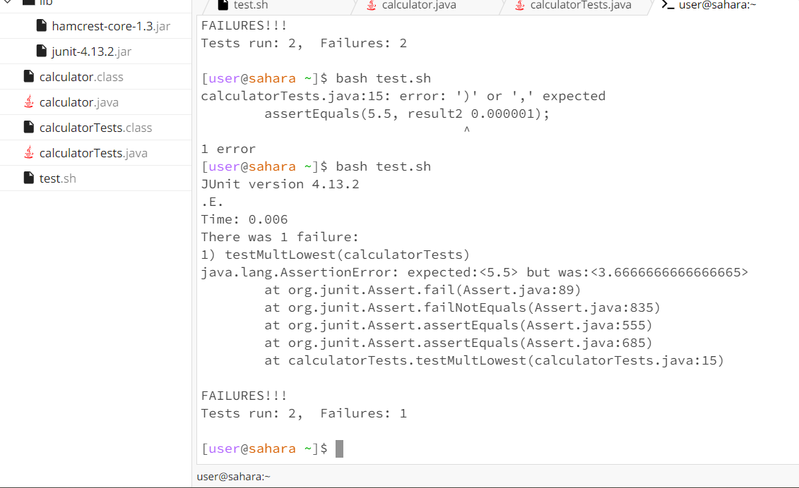
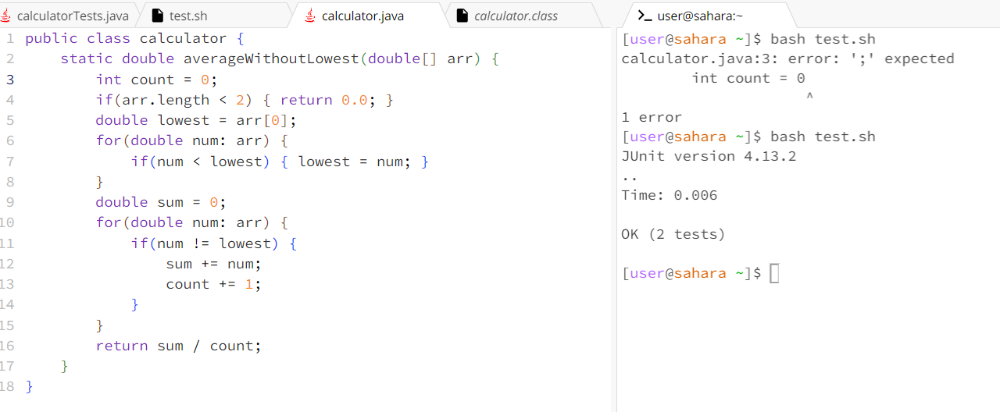
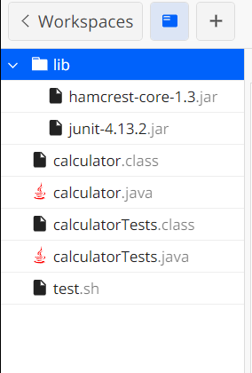

# Lab Report 5  
## Part 1 – Implementation Polishing  


**EdStem Post:**
### Test Failure Calculation Help
*Anonymous:*  
Hi,  
When I run my tests for my calculator class I get a failure on one of my tests that I'm having trouble debugging. I am expecting to get 5.5 for the average in a test case that tests `{2, 5, 6, 2}` but am instead getting 3.6666. How do I debug this?
  

### TA Response
I need more information to help you debug this. Can you send the code for your test case and the code that is failing? 

### Student Reponse
Yes, here is the code for my calculator class, which calculates the average of all the numbers that aren't the lowest in an array. 
```
public class calculator {
    static double averageWithoutLowest(double[] arr) {
        if(arr.length < 2) { return 0.0; }
        double lowest = arr[0];
        for(double num: arr) {
            if(num < lowest) { lowest = num; }
        }
        double sum = 0;
        for(double num: arr) {
            if(num != lowest) { sum += num; }
        }
        return sum / (arr.length - 1);
    }
}
```
Here is the code for my test which caused the error of the expected value not matching the actual value. The first test in my test class passes, but the second one fails. 
```
public class calculatorTests {
    @Test
    public void testLowestSum() {
        double[] arrLowest = {1.0, 7.0, 9.0};
        double result1 = calculator.averageWithoutLowest(arrLowest);
        assertEquals(8.0, result1, 0.00001);
    }
    @Test
    public void testMultLowest() {
        double[] arrMultLowest = {2.0, 5.0, 6.0, 2.0};
        double result2 = calculator.averageWithoutLowest(arrMultLowest);
        assertEquals(5.5, result2, 0.000001);
    }
}
```
### TA Response  
Check the difference between your test cases, specifically what you are expecting with the lowest number in the array. What behavior does averaging all the numbers but the lowest do in terms of calculating the average? How do we know which values to take into account?  
Try looking at how you update your local variables and why having two lowest values differ from just having one.  

### Student Reponse
Thank you! I see that I assumed that there would only be one lowest value, and my test failed because there were two elements that were both equal to the minimum. Since I was dividing my sum by `arr.length - 1`, I missed this edge case. To fix this, I created a `count` variable that would increment each time I added to the sum, then divided the sum by the `count` to avoid this issue. My tests ended up passing!
  


## The file & directory structure needed  
  
I have a `calculator.java` file that has my main code for calculating the average (without the lowest numbers) and a `calculator.class` file from compiling. I also have a `calculatorTests.java` file that I use to test my code, and similarly a `calculatorTests.class` file from compiling this. I also have one bash file called `test.sh` that I use to run the commands that compile and run my tests. Because my test file uses JUnit, I also had to upload the `hamcrest` and `JUnit` files located in the `lib` folder.  


## The contents of each file before fixing the bug  
Before fixing the bug:  
1. calculator.java
```
public class calculator {
    static double averageWithoutLowest(double[] arr) {
        if(arr.length < 2) { return 0.0; }
        double lowest = arr[0];
        for(double num: arr) {
            if(num < lowest) { lowest = num; }
        }
        double sum = 0;
        for(double num: arr) {
            if(num != lowest) { sum += num; }
        }
        return sum / (arr.length - 1);
    }
}
```
2. calculatorTests.java
```
public class calculatorTests {
    @Test
    public void testLowestSum() {
        double[] arrLowest = {1.0, 7.0, 9.0};
        double result1 = calculator.averageWithoutLowest(arrLowest);
        assertEquals(8.0, result1, 0.00001);
    }
    @Test
    public void testMultLowest() {
        double[] arrMultLowest = {2.0, 5.0, 6.0, 2.0};
        double result2 = calculator.averageWithoutLowest(arrMultLowest);
        assertEquals(5.5, result2, 0.000001);
    }
}
```
3. test.sh
```
set -e
CPATH='.:lib/hamcrest-core-1.3.jar:lib/junit-4.13.2.jar'

javac -cp $CPATH *.java
# javac calculatorTests.java
if [ $? -ne 0 ]
then 
    echo "Compilation Error"
    exit 1
fi
# java calculatorTests

java -cp $CPATH org.junit.runner.JUnitCore calculatorTests
```

## The full command line (or lines) you ran to trigger the bug  
I ran `bash test.sh` in the terminal (see `test.sh` above).   

## A description of what to edit to fix the bug  
The original code assumed that the average would always be the sum divided by `arr.length - 1`. This assumes that there is only one element in the list that is not added to the sum. This is not always the case. Since calculating the sum compares the number to the minimum, any number that equals the lowest number is excluded from the sum, and therefore should not be counted in the average calculation. However, if we have an array with multiple numbers that match the lowest, we don't account for the extra numbers. This is why I needed to add the `count` variable.
```
        double sum = 0;
        int count = 0; <-- new local variable
        for(double num: arr) {
            if(num != lowest) { 
                sum += num; 
                count += 1; <-- increments to accurately get number of values
            }
        }
        return sum / count; <-- passes edge cases described in the tester
```
The above code shows the changed code after calculating the lowest number. By incrementing the `count` variable only when a number is NOT equal to `lowest`, we make sure that we only divide the sum by the number of elements that are counted in the average calculation.


## Part 2 – Reflection
I really enjoyed learning about `vim` during this second half of the quarter. Vim tutor was super useful and interactive, and it really helped me understand how to do text editing within the command line. It felt really rewarding to use some of the shortcuts and make edits straight from the command line, and it is something that I feel more comfortable with doing in the future.  

